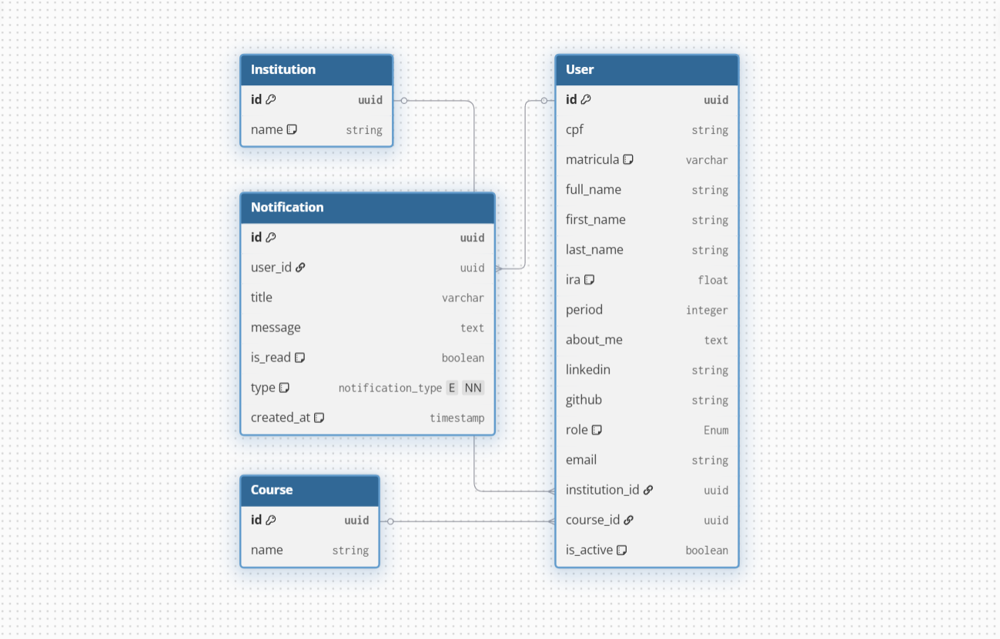

# Atlas Auth Service 🔐

Microserviço de autenticação do ecossistema **ATLAS**, desenvolvido com **Django** + **Django REST Framework** e integrado ao **SUAP** (OAuth2). O serviço roda em **Docker** com **PostgreSQL** e entrega autenticação baseada em **JWT**.

## Principais Funcionalidades

- Login via SUAP (gera URL de autorização e processa o callback)
- Emissão de tokens **JWT** (`access` e `refresh`) via **SimpleJWT**
- Renovação de sessão (`refresh`) e logout com blacklist do refresh token
- Modelo de usuário customizado (UUID, CPF, matrícula e campos acadêmicos/perfil)
- Servidor **gRPC** (`GetUserProfile`) para consumo interno por outros microsserviços

## Stack

- Python 3.11 · Django 4.2 · Django REST Framework
- SimpleJWT (com rotação e blacklist)
- PostgreSQL · Redis · Docker
- gRPC / grpcio-tools

## Estrutura

- `apps/authentication/` — models, views, serializers e lógica de domínio
- `config/` — settings, urls, asgi, wsgi
- `proto/user.proto` — contrato gRPC
- `docs/` — documentação técnica e diagramas

> 

## Executando localmente

Este serviço é orquestrado junto com todos os outros pelo repositório central de infraestrutura:

> **[Atlas-IFRN/atlas-infra](https://github.com/Atlas-IFRN/atlas-infra)** — Docker Compose canônico, Nginx, scripts de deploy e backup.

Para subir apenas a infraestrutura compartilhada (Postgres, Redis, RabbitMQ) e rodar este serviço isolado em modo dev:

```bash
# 1. Suba a infra compartilhada
git clone https://github.com/Atlas-IFRN/atlas-infra
cd atlas-infra
docker compose -f docker-compose.dev.yml up -d

# 2. Neste repositório
cp .env.example .env   # preencha as variáveis
python manage.py migrate
python manage.py runserver 8000

# 3. (Opcional) Servidor gRPC em processo separado
python grpc_server.py
```

## Variáveis de ambiente

Veja [`.env.example`](.env.example). Principais:

- **Django**: `DJANGO_SECRET_KEY`, `DJANGO_DEBUG`, `DJANGO_ALLOWED_HOSTS`
- **Banco**: `DATABASE_URL`, `POSTGRES_*`
- **SUAP**: `SUAP_CLIENT_ID`, `SUAP_CLIENT_SECRET`, `SUAP_REDIRECT_URI`
- **JWT**: configurado via `SIMPLE_JWT` no settings

> Garanta que `SUAP_REDIRECT_URI` esteja cadastrado no SUAP e consistente com o `.env`.

## Endpoints HTTP

Base URL local: `http://localhost:8000`

### Saúde
- `GET /health/` → `{"status": "ok"}`

### Autenticação (prefixo `/api/auth/`)

| Método | Endpoint | Auth | Descrição |
|--------|----------|------|-----------|
| `GET`  | `/api/auth/suap/login/` | público | Retorna `login_url` para o frontend redirecionar ao SUAP |
| `POST` | `/api/auth/suap/callback/` | público | Troca `code` por JWT e sincroniza usuário |
| `POST` | `/api/auth/refresh/` | público | Renova `access` token |
| `POST` | `/api/auth/logout/` | ✓ | Faz blacklist do `refresh` token |

### Perfil e Notificações

| Método | Endpoint | Descrição |
|--------|----------|-----------|
| `GET`  | `/api/auth/users/me/` | Perfil do usuário autenticado |
| `GET`  | `/api/auth/users/<matricula>/` | Perfil público por matrícula |
| `GET`  | `/api/auth/notifications/` | Notificações recentes (últimos 5 dias) |

Campos retornados pelo `UserSerializer`: `id`, `matricula`, `first_name`, `full_name`, `email`, `cpf`, `role`, `ira`, `period`, `about_me`, `linkedin`, `github`, `curriculo_lattes`, `course_name`, `institution_name`.

## gRPC

- Proto: [`proto/user.proto`](proto/user.proto)
- Serviço: `UserService.GetUserProfile(UserRequest) -> UserResponse`
- Porta: `50051`

Regenerar stubs após alterar o `.proto`:

```bash
python -m grpc_tools.protoc -I=proto --python_out=proto --grpc_python_out=proto proto/user.proto
```

## Qualidade de código

```bash
pip install pre-commit
pre-commit install
pre-commit run --all-files
```

Hooks configurados: Black, isort, autoflake, checagem Django.

